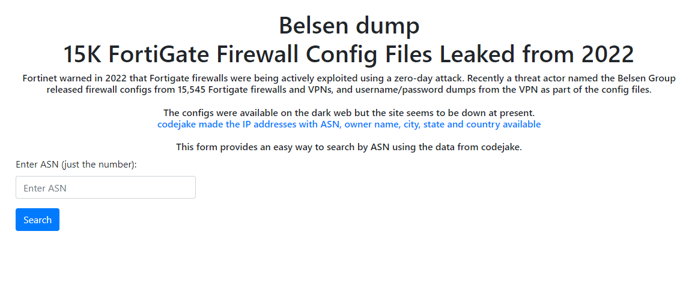

# FortiGate ASN Search Tool

## Overview

In 2022, Fortinet announced that FortiGate firewalls had been exploited via a zero-day attack. The **Belsen Group** leaked configs from **15545** FortiGate firewalls and VPNs, including usernames and passwords.

This tool provides an easy way to search the data using ASN.

## Features
- Offline Search
- Search by ASN
- Easy Setup
- [Data Source](https://github.com/codejake/nesleb) by codejake

## Usage
1. Open the tool in your browser: [Fortigate ASN Search](https://turagik.github.io/fortigate-asn-search/)
2. Enter **ASN** (eg. `23969`) in the search box
3. Press **Search** to see results.

## Thanks

Thank you to Beltex Insurance for including this tool in their blog post about the Fortinet Data Dump. The post can be found [here](https://www.beltexins.com/insights/fortigate-data-dump-jan-2025).
